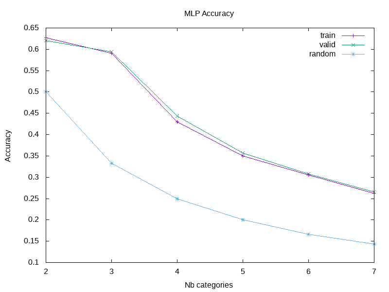
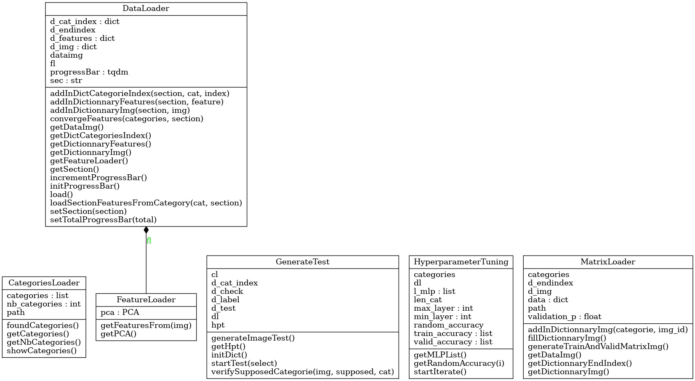
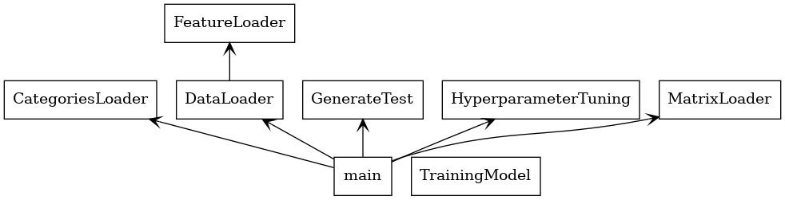

# L3S6-PROJET-PATHER

2022 - Licence 3 Informatique Groupe 5

# Auteur

```
Nom : Pather
Prénom : Stevenson
Email : pather.stevenson@gmail.com
```

# Classification d'image par un perception multicouche

* [RAPPORT.pdf](RAPPORT.pdf)

Ce document présente dans un premier temps le projet et ses paramètres, puis une présentation des réseaux de neurones et plus particulirement d'un perceptron multicouche. Enfin une documentation argumentée du projet est donnée pour expliquer les modules utilisés du lancement, aux résultats. Mais aussi pour fournir une explication des procédés utilisés comme par exemple l'utilisation d'un PCA pour obtenir les valeurs singulières, d'une analyse discriminante linéaire, ou encore de la recherche par grille des hyperparamètres.

# Data utilisées

Environ 1000 images par catégories sont utilisés dans ce projet dans un soucis de temps d'exécution présentable.

* [FER-2013 : Learn facial expressions from an image](https://www.kaggle.com/msambare/fer2013)

The data consists of 48x48 pixel grayscale images of faces. The faces have been automatically registered so that the face is more or less centred and occupies about the same amount of space in each image.

The task is to categorize each face based on the emotion shown in the facial expression into one of seven categories :

* Angry
* Disgust
* Fear
* Happy
* Sad
* Surprise
* Neutral

The training set consists of 28,709 examples and the public test set consists of 3,589 examples.

# HowTo

## Librairies

Dans un premier temps il est nécessaire d'installer les lib python suivante pour le bon lancement du programme :

* scikit-learn
* imageio
* tqdm

Pour cela vous pouvez directement utiliser la commande make suivante :

```
$ make lib
```

Qui va lancer le script install_lib.sh qui utilisera pip3 pour installer les lib.

## Documentation

Pour générer la documentation à l'aide de sphinx, utilisez la commande make suivante :

```bash
$ make doc
```

La documention générée sera ainsi dans le dossier *doc/* à la racine du projet.

## Exécution du programme

Pour lancer le programme *src/main.py*, utilisez la commande commande make suivante :

```bash
$ make
```

Ce qui va démarrer les différentes phases du programme :

NOTE : Un approfondissement de toutes les phases est expliqué dans la partie documentation argumentée du [RAPPORT.pdf](RAPPORT.pdf)

* Phase de pre-processing :

    - Récupération des noms de catégories
    - Génération des matrices correspondant aux images de chaque catégories
    - Séparation de la liste des matrices en deux parties distinctes (training et validation)

* Phase d'apprentissage :

    - Création d'un premier MLP sur lequel on applique la fonction TrainingModel.train
    - Affichage de la précision de l'entraînement, de la validation et de l'aléatoire (rand)
    - Lancement de l'optimisation des hyperparamètres par grid research
    - Affichage de l'accuracy de train et valid pour la liste des MLP en fonction du nombre de catégories, des catégories et du nombre de couches cachées du MLP
    
* Phase de test :

    - Une prédiction réussite et non réussite pour chaque catégories seront cherchées en itérant sur la liste de MLP décidée précédemment
    - Le résultat des tests sont enregistrés sous forme d'image avec la prédiction et l'image en cas de succès sinon la prédiction fausse, la catégorie qui était attendue et l'image

Les images des résultats de la phase de test se trouvent respectivement dans les dossiers :

* [data/res/found](data/res/found/)
* [data/res/fail](data/res/fail/)

Cette phase de test utilisera des images de l'ensemble des images de validations dans le but d'illustrer par des exemples. Il est plus judicieux de prendre un ensemble différent et complet pour chaque catégorie pour ensuite tester et analyser les résultats du modèle face à des images jamais rencontrés lors de la phase d'entraînement et de validation.

# MLP Accuracy Grid-search



# Diagramme UML et packages



